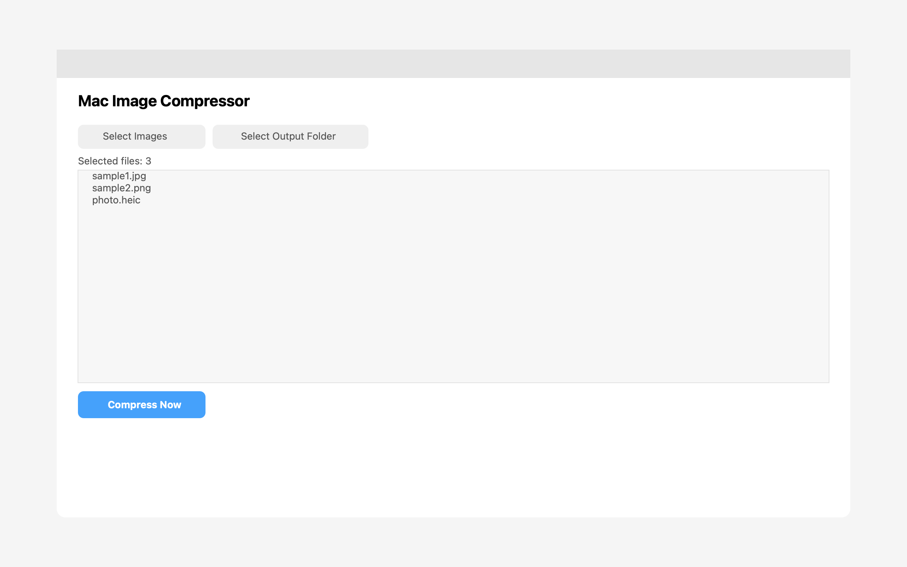

# mac-image-compressor

A lightweight macOS SwiftUI app to batch-compress images.


## Download

Download the latest build from **GitHub Releases**:

- https://github.com/imjposcar/mac-image-compressor/releases/latest

You can choose either:
- `MacImageCompressor-macOS.dmg` (recommended)
- `MacImageCompressor-macOS.zip`

### Install

#### Option 1: DMG (recommended)
1. Download `MacImageCompressor-macOS.dmg`
2. Open the DMG
3. Drag **MacImageCompressor.app** into **Applications**
4. Open the app from Applications

#### Option 2: ZIP
1. Download `MacImageCompressor-macOS.zip`
2. Unzip it
3. Move **MacImageCompressor.app** into **Applications**
4. Open the app

> If macOS warns about an unidentified developer, right-click the app, choose **Open**, then confirm.

## Screenshot



## Features

- Select multiple images at once
- Choose output format: JPEG / PNG / HEIC / WebP
- Quality slider
- Max width resize
- Optional metadata preservation
- Output logs with before/after size and savings

## Usage

1. Click **Select Images** and choose one or more files.
2. Click **Select Output Folder**.
3. Pick output format and quality.
4. Click **Compress Now**.

Compressed files are written as:

`<original-name>-compressed.<ext>`

## Supported input types

PNG, JPEG, TIFF, HEIC, GIF, BMP, WebP

## Build from source

```bash
swift build
swift run
```

> Running `swift run` opens the macOS app window.
